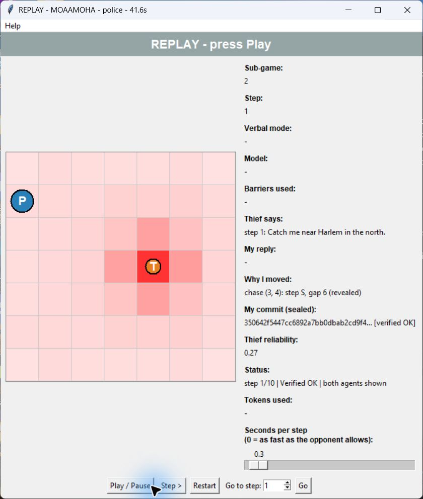
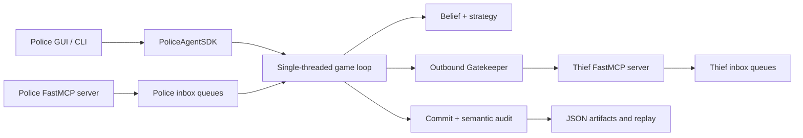

# Police Agent

An autonomous Police peer for a distributed Police-versus-Thief pursuit game. It
combines a Bayesian belief map, an explainable chase-and-barrier policy,
peer-to-peer FastMCP messaging, commit-reveal auditing, a live GUI, and a
cryptographically verified replay viewer.

## Repository relationship

This repository, **police-agent**, is the project's main repository: it carries
the Police process and the cross-repository submission evidence. The companion
process, the [Thief agent](https://github.com/Moaawiyah/Ai_thief), lives in its
own repository and is developed against the same shared contract.

The two agents are deliberately independent: separate processes, separate
repositories, no shared memory or imported live state. They only ever talk to
each other over FastMCP, and only ever trust each other's claims after a
commit-reveal audit. Both repositories carry a byte-identical copy of the
shared `game.json` terms; a change to that contract must be applied and
validated on both sides.

## Screenshots

Live-run evidence, captured from a real two-process match on localhost.

| Live Police GUI | Verified cross-log replay |
| --- | --- |
|  |  |

The live window shows only what Police can legitimately see during play: its
own position and trail, declared barriers, the scent-derived belief heatmap,
the received hint, its own reply, its decision rationale, and its sealed
commitment. It never reveals the Thief's true location. The replay view
reconstructs both tracks from the revealed logs and recomputes every
commitment; `Verified OK` only appears when that recomputation matches what was
originally sealed.

Additional evidence — a public match over a tunnel, for example — can be added
to [`assets/screenshots/`](assets/screenshots) and linked here.

## Problem model

The game is a finite-horizon decentralized partially observable Markov decision
process, `<I, S, {A_i}, T, R, {Omega_i}, O, gamma>`:

| Element | Police interpretation |
| --- | --- |
| Agents `I` | One Police peer and one Thief peer, each its own OS process |
| State `S` | Both private positions, placed barriers, scent field, turn number, commitments, terminal condition — no single process holds all of it |
| Actions `A_i` | Legal orthogonal movement or stay, plus barrier placement and capture claims; the domain layer rejects illegal actions before transmission |
| Transition `T` | Deterministic board movement and barrier effects; policy randomness is limited to seeded selection among genuinely tied moves |
| Observations `Omega_i` | Own state, received hints, a local scent grid, public claims and protocol metadata — never the Thief's true cell |
| Observation model `O` | Prediction diffuses probability over legal reachable cells; the update weights cells by peak-relative scent intensity and renormalizes |
| Reward `R` | The signed scoring table: capture, survival, exploration, and zero for a technical loss |
| Discount `gamma` | Short fixed horizon; the agent optimizes the signed terminal score rather than a learned discounted return |

The belief state `b_t(s) = P(thief_position = s | observations_1:t)` is the
Police agent's sufficient statistic for decision-making. Each turn first
diffuses probability according to legal Thief motion, then applies the new
scent likelihood. A small uniform leak and stale-cell decay prevent old
evidence from becoming permanently dominant.

## Architecture and trust boundaries

`PoliceAgentSDK` is the public application boundary. The CLI and GUI delegate
to it; game rules do not import network or presentation code, and strategies
receive only legal candidates. The live view consumes immutable snapshots so
Tk never reads state while the worker thread mutates it.



There is no referee or central server: each peer is simultaneously a FastMCP
server for inbound tools and a client of the opponent's `/mcp` endpoint. That
symmetry creates five practical problems, addressed as follows:

1. **Startup order.** Connection refusal is normal when two people launch
   independently. Negotiation retries within a bounded deadline and reports a
   transport error only when that budget is exhausted.
2. **Turn ownership.** Receiving `receive_turn` is the token hand-off. MCP tool
   handlers enqueue raw messages and return quickly; the single game loop
   performs all reasoning.
3. **Conversation isolation.** Agreement, turn, control and audit traffic use
   separate thread-safe queues, so a late reveal can never be consumed as a move.
4. **Rate and failure control.** Outbound MCP, model and Gmail calls pass
   through configured gatekeepers with FIFO admission, concurrency limits,
   token-bucket pacing, bounded retry/backoff and anomaly counters. A watchdog
   stops a stalled game loop.
5. **Claims under partial observability.** Police cannot validate the Thief's
   true position during play. It records commitments, exchanges reveals after
   termination, verifies the hashes, then replays semantic rules over the
   revealed positions.

The security model has four layers:

1. `game.json` contains the shared terms and must be byte-identical on both peers.
2. The pre-game handshake compares terms, identities and signed declarations.
3. Every move is sealed as `SHA-256(canonical_json(payload) | nonce)` before reveal.
4. The end-game audit verifies hashes, sequence, claims, positions,
   capture/survival semantics and terminal consistency. A failed audit
   overrides the board result.

Replay protection keys accepted inbound turns by commitment. Credentials,
OAuth tokens, private endpoints and per-peer tuning belong only in ignored
`game.toml` or provider-owned configuration; they must never be committed.

## Police strategy

- **Bayesian tracking:** a uniform prior is diffused over stay/N/S/E/W
  reachability, excluding barriers, then updated with the 5x5 scent packet.
- **Stale-evidence control:** peak-relative weighting, configurable
  trust/power, posterior leak and compounded stale decay keep the map
  responsive to new evidence.
- **Hint reliability:** location language is compared with scent support.
  Repeated contradictions reduce the speaker's reliability and therefore its
  influence on the belief map.
- **Chase policy:** minimize Manhattan distance to the most likely Thief cell,
  prefer an unvisited cell on equal distance, then use seeded randomness only
  among remaining ties.
- **Barrier policy:** spend a barrier only when a legal deterministic
  placement reduces escape or improves expected enclosure over the
  high-probability region. It never walls before scent evidence or traps
  Police itself.
- **Safe verbal layer:** a language model writes and interprets game text, and
  each outgoing hint is committed with an explicit truth/lie intent flag before
  it is sent. Python alone selects every move; provider failure falls back to
  templates without changing game legality.

Custom strategies can subclass `PoliceBrainBase` and configure
`strategy.police_class = "package.module:ClassName"` in the private
`game.toml`.

### Verbal layer and language model

The recorded matches used **GLM-4.7-FlashX**, served over the OpenAI-compatible
z.ai endpoint (`https://api.z.ai/api/paas/v4`), for both halves of the verbal
layer: writing this peer's outgoing taunt, and reading the Thief's incoming
hint to classify the direction it claims. A small, fast model is deliberate —
the taunt must never eat into the turn budget.

The model shapes text only. It never chooses a move, evaluates legality, or
touches the belief map's arithmetic; that boundary is enforced in code and
covered by tests. Before each hint is written, the peer decides whether that
turn's line will be honest or a bluff, and seals that intent into the turn's
commitment, so it cannot claim afterwards that a lie was accidental.

Set the API key in the environment — never in a committed file:

```bash
export ZAI_API_KEY="<your-key>"
```

Provider selection lives in the private `config/police/game.toml` under
`[trash_talk]`. `provider = "glm"` is the shipped default; `"ollama"` runs a
local model instead (`qwen3:4b` by default), and `"template"` uses canned
lines and spends no tokens at all. Any provider failure — missing key, server
down, timeout, malformed reply — degrades to those canned lines rather than
costing the match. Token spend is metered per step through the gatekeeper and
sealed into each turn's record.

### Evidence and parameter study

No reinforcement-learning model is trained or claimed. This project uses an
explicit Bayesian filter and a hand-engineered, explainable policy, evidenced
by a parameter sensitivity study: all nine tunable constants swept one at a
time over 500 episodes per point against a synthetic evader, with 95%
confidence intervals. See [docs/RESEARCH.md](docs/RESEARCH.md), the figures in
[assets/](assets), the raw numbers in
[docs/research-data.json](docs/research-data.json), and the interactive
version in [notebooks/sensitivity.ipynb](notebooks/sensitivity.ipynb).
Regenerate everything with:

```bash
uv sync --extra research
uv run python -m research
```

## Installation

Requirements:

- Python 3.13 or newer
- [uv](https://docs.astral.sh/uv/)
- Tk support for `--gui` and interactive `--replay`
- Optional: a development tunnel service for public matches (local.dev, or
  ngrok — which `--tunnel` can drive automatically), Ollama for local
  generated dialogue, Google client libraries for live Gmail delivery, and
  ffmpeg for MP4 export

```bash
git clone https://github.com/Moaawiyah/police-agent.git
cd police-agent
uv sync --all-extras --dev
cp config/police/game.toml.example config/police/game.toml
```

Edit the ignored `config/police/game.toml` with your group metadata,
repository URLs, local port and opponent URL. Keep real student identifiers
and credentials out of public examples and screenshots.

## Running

The shared `game.json` fixes board physics, scent parameters, scoring,
network deadlines, game count, token budget and rate limits. The private
`game.toml` selects identity, endpoints, strategy tuning, GUI pacing, model
provider and email behavior.

Command examples use POSIX line continuations (`\`). In PowerShell, replace
each trailing `\` with a backtick, or put the command on one line.

### Run with the live GUI

Start Police first; the GUI opens idle, which gives the Thief time to start
before you press **Start**:

```bash
# Terminal 1 — police-agent repository
uv run police-agent --gui --port 8801 \
  --opponent http://127.0.0.1:8802/mcp \
  --summary logs/police-summary.json --report

# Terminal 2 — Ai_thief repository
uv run thief-agent gui --config-dir config/thief \
  --port 8802 --opponent-url http://127.0.0.1:8801/mcp
```

Add `--series` on the Police side to play the whole agreed series
(`game.num_games`) instead of a single sub-game. The Thief's `gui` subcommand
already plays its configured series, so it takes no equivalent flag.

### Run a counted match

`--count` marks the run whose report is actually mailed to the lecturer (cc'd
on `email.recipient` rather than sent to that address alone). Counting is
Police's responsibility: the Thief peer has no equivalent flag and plays a
counted match exactly the way it plays any other.

```bash
# Counted series, with the live GUI
uv run police-agent --gui --series --report --count --port 8801 \
  --opponent http://127.0.0.1:8802/mcp

# Counted series, headless
uv run police-agent --series --report --count --port 8801 \
  --opponent http://127.0.0.1:8802/mcp
```

### Replay a match

Replay verifies as it plays: it recomputes every commitment from the revealed
logs and only reports `Verified OK` if each one matches what was sealed during
the match. Point it at a per-sub-game `log_` file — the aggregate
`result_<game_id>.json` holds only the series score and has no per-step data:

```bash
uv run police-agent --replay logs/MOAAMOHA/log_MOAAMOHA-vs-cosmos77_g01.json
```

That file already carries this peer's sealed records and the opponent's turn
messages, so both tracks replay from it alone. `--opponent-log` is only needed
to overlay the Thief's own separately written log:

```bash
uv run police-agent --replay logs/MOAAMOHA/log_MOAAMOHA-vs-cosmos77_g01.json \
  --opponent-log ../Ai_thief/logs/MOAAMOHA/record_MOAAMOHA-vs-cosmos77_g02.json
```

Render to a file instead of opening a window with `--export`:

```bash
uv run police-agent --replay logs/MOAAMOHA/log_MOAAMOHA-vs-cosmos77_g01.json \
  --export results/game-1.gif
```

GIF export needs Pillow only. MP4 export additionally requires `ffmpeg` on `PATH`.

### Public matches and reporting

Both peers normally sit behind NAT, so a league match needs a publicly
reachable URL rather than `127.0.0.1`. The recorded league series used
**local.dev** as the development tunnel service: it publishes the local
FastMCP mailbox on a public HTTPS subdomain the opposing team can call.

Start your tunnel against this peer's MCP port (8801 by default), keep it
running for the whole series, and note the forwarding URL it prints — the
Police peer in the recorded matches was published as
`https://calm-lantern-322.local.dev`. Then give the opposing team that URL with
`/mcp` appended, and put theirs in `network.opponent_url` in the private
`config/police/game.toml`:

```toml
opponent_url = "https://<their-subdomain>.local.dev/mcp"
```

With the tunnel up and a public `opponent_url` configured, play the series
exactly as you would locally:

```bash
uv run police-agent --series --report --count
```

**ngrok is also supported**, and is the one service this repository can drive
for you. Authenticate once (`ngrok config add-authtoken <your-token>` — ngrok
keeps it in its own config; this project never reads or holds it), reserve a
domain at <https://dashboard.ngrok.com/domains>, and set it as `tunnel_domain`
in the private `game.toml`. Then `--tunnel` starts ngrok after the MCP server
binds and reads the public URL back from ngrok's local agent API on
`127.0.0.1:4040`, adopting a tunnel you already opened by hand rather than
starting a competing one:

```bash
uv run police-agent --tunnel --series --report --count
```

`--league` adds the strict league profile on top. It is enforced, not
advisory, and **requires `--tunnel`**: it also demands a configured
`tunnel_domain`, an HTTPS opponent URL that is neither localhost nor a private
address, and `turn_timeout_seconds` equal to `watchdog_timeout_seconds`. Any
of those missing is a startup `ConfigError`:

```bash
uv run police-agent --league --tunnel --series --report --count
```

Because `--league` is wired to the built-in ngrok tunnel, a match run over a
manually started tunnel such as local.dev uses the plain `--series` form above
rather than `--league`.

Keep both tunnels and both peer processes alive for the entire series. A
localhost run, or an open tunnel on its own, is not interoperability proof:
both peers must finish, agree on the outcome, pass mutual audit and replay,
release their ports, and have the exact commits and public URLs recorded in
the declaration artifact.

The report writer produces declaration, config, per-sub-game log and
aggregate result JSON under `logs/<group_id>/`. Gmail is off by default.
Follow [docs/GMAIL_SETUP.md](docs/GMAIL_SETUP.md) for the send-only OAuth
scope and deliberate authorization flow. Never share `credentials.json` or
`token.json`.

## Validation

```bash
uv run pytest
uv run pytest --cov=police_agent --cov-report=term-missing:skip-covered
uv run ruff check .
uv run ruff format --check .
```

CI runs the same gates plus a file-size check: every Python file under `src/`
and `tests/` must stay at or below 150 nonblank/noncomment lines.

Coverage omits only the four modules that construct Tk widgets and so cannot
run in a headless test process (`gui/board_view.py`, `gui/live_controls.py`,
`gui/replay_controls.py`, `gui/window.py`); everything else, the rest of
`gui/` included, is measured. `research/` is measured alongside `src/`: the
sensitivity study's conclusions rest on that code, so exempting it would
exempt the evidence.

## Repository map

```text
src/police_agent/
  domain/    rules, state, actions, cryptographic and semantic audit
  peer/      handshake, protocol, turn loop, series and summaries
  strategy/  belief filter, hint analysis, chase and barrier policy
  infra/     FastMCP, tunnel, Ollama, Gmail, hardware and Git adapters
  shared/    gatekeeper, quotas, tokens, rate limiting and utilities
  report/    declaration, config, log and final-result artifacts
  sdk/       supported application facade and replay/report APIs
  gui/       live board, replay player and headless export
research/    parameter sweeps and the synthetic evader they run against
notebooks/   the sensitivity study as a runnable notebook
config/police/  the shared game.json and the private game.toml example
```

## Documentation

Start with [docs/FEATURES.md](docs/FEATURES.md), then:

- [Architecture](docs/ARCHITECTURE.md)
- [Core gameplay](docs/CORE_GAMEPLAY.md)
- [Police strategy](docs/POLICE_STRATEGY.md)
- [P2P protocol](docs/P2P_PROTOCOL.md)
- [Security and audit](docs/SECURITY_AND_AUDIT.md)
- [GUI, replay and export](docs/GUI_REPLAY_EXPORT.md)
- [Reporting and series](docs/REPORTING_AND_SERIES.md)
- [Interoperability and operations](docs/INTEROPERABILITY_AND_OPERATIONS.md)
- [Gatekeeper and tokens](docs/GATEKEEPER_AND_TOKENS.md)
- [Verbal layer](docs/VERBAL_LAYER.md)
- [Extension points](docs/EXTENSION_POINTS.md)
- [SDK, CLI and configuration](docs/SDK_CLI_CONFIGURATION.md)
- [Research and sensitivity study](docs/RESEARCH.md)
- [ISO/IEC 25010 quality mapping](docs/ISO25010.md)
- [Prompt engineering log](docs/PROMPTS.md)
- [Product requirements](docs/PRD.md) and [development plan](docs/PLAN.md)

## Roadmap to submission

- Repeat the public tunnelled interoperability run on the current revisions.
- Complete a real Gmail OAuth authorization and send.
- Record matches against at least two different external opponent groups.
- Cut the annotated `v1.0-submission` tag once the above are done.

Track the actionable list in [docs/TODO.md](docs/TODO.md).

## Contributing

Keep changes behind the SDK boundary, preserve the separate-process trust
model, add tests for behavior, and run the validation commands above. Python
files under `src/` and `tests/` must remain at or below 150 nonblank/noncomment
lines. Do not commit logs, private config, OAuth files, tokens or provider
credentials.

## Credits and license

Developed for the University of Haifa's distributed AI course project on
trust-minimized multi-agent systems, taught by **Dr. Yoram Segal**. The course
specification and the reference implementation,
[rmisegal/Game-P2P-Cop-Chase](https://github.com/rmisegal/Game-P2P-Cop-Chase),
are Dr. Segal's; both are gratefully acknowledged. The GUI structure was
informed by that reference, while the protocol, security model, strategy and
evidence model in this repository were designed and written independently.

Released under the [MIT License](LICENSE). Course rules still apply to
submission and academic conduct: the license governs reuse of the code, not
the coursework it was written for.
