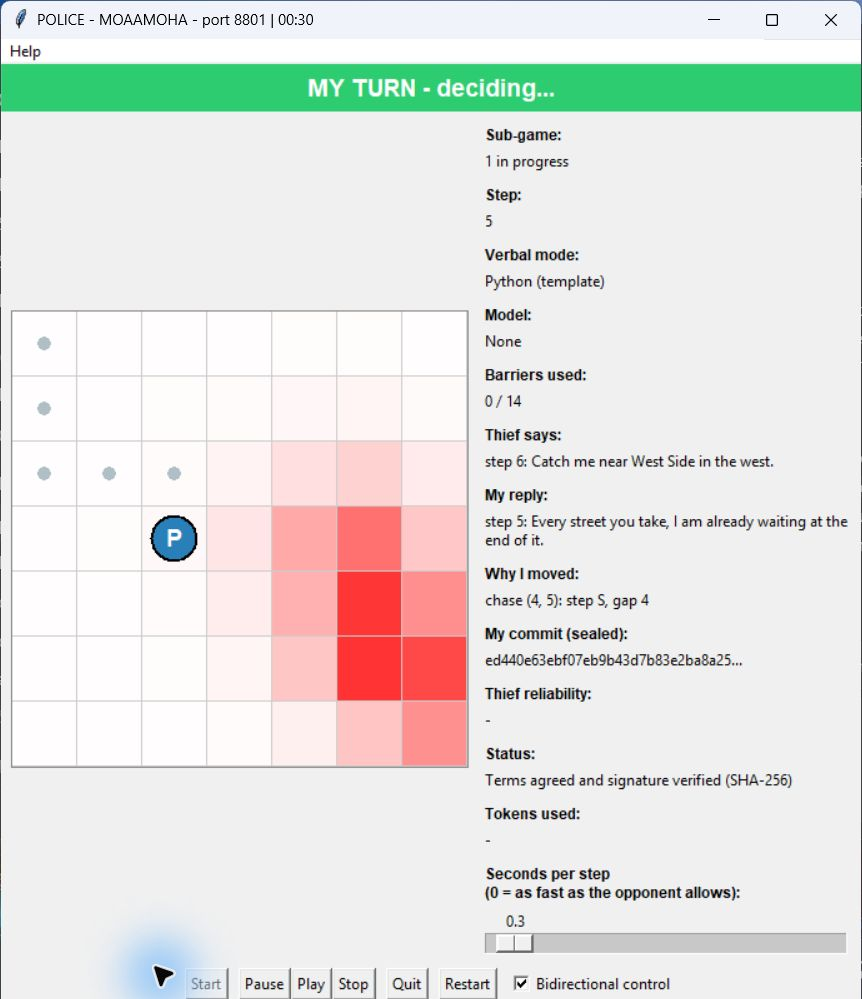
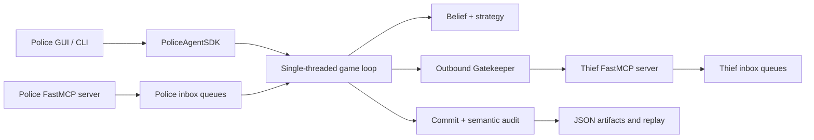

# Police Agent

An autonomous Police peer for the course's distributed Police-versus-Thief game. It
combines a Bayesian belief map, an explainable chase-and-barrier policy, peer-to-peer
FastMCP messaging, commit-reveal auditing, a live GUI, and a cryptographically verified
replay viewer.

This repository contains only the Police process. The companion implementation is the
[Thief agent](https://github.com/Moaawiyah/Ai_thief). The separation is deliberate: the
agents run in different processes and repositories and never share hidden state.

## Project status

| Area | Status | Evidence |
|---|---|---|
| Police gameplay and strategy | Implemented and tested | Legal movement, Bayesian tracking, hint reliability, barriers, capture and survival handling |
| P2P protocol | Implemented and tested | FastMCP negotiation, turns, control messages, audit reveal, retries, watchdogs and queues |
| Security and reporting | Implemented and tested | Signed terms, commit-reveal, semantic audit, anti-replay, four JSON report artifacts |
| Live GUI and replay | Fresh-local verified | Two real processes completed a two-game localhost series on 2026-08-12; cross-log replay showed `Verified OK` |
| Public league delivery | Open | Authenticated reserved-domain ngrok run has not been repeated on the current revisions |
| Gmail delivery | Open | Local draft and mocked send paths are tested; a real Gmail API send has not been performed |
| Course submission release | Open | Cross-group league matches and the annotated submission tag remain outstanding |

“Fresh-local verified” is intentionally narrower than “league verified.” It proves that
the current Police and Thief revisions exchanged real MCP traffic as separate processes
on localhost; it does not prove public-internet behavior, Gmail delivery, or performance
against other groups.

## Fresh two-process evidence

The evidence run used Police commit `8816dcf4dac01a11386cb2829432d127502ed329`
and Thief commit `f17255caa7b45174c925917193f442dd3a4d5577`. Both peers loaded
byte-identical `game.json` files (raw SHA-256
`3e3d053c30d7d67ec4c9c51e20f246995fb8ac71c1ffdd0ea2595571f131342d`),
negotiated signed terms, played two sub-games, revealed their sealed logs, and exited
with ports 8801 and 8802 released.

| Sub-game | Result | Winner | Steps | Police audit |
|---:|---|---|---:|---|
| 1 | Capture | `MOAAMOHA` | 10 | Log verified; not tampered |
| 2 | Capture | `MOAAMOHA` | 9 | Log verified; not tampered |
| Series | 40–10 | `MOAAMOHA` (2–0) | 19 total | Both peers reported the same observable outcome |

The run used deterministic template dialogue and zero model calls, so it is evidence of
the game, protocol, audit and visualization paths—not of an external LLM provider.

### Live Police view

The live window shows only information available to Police during play: its position and
trail, declared barriers, the scent-derived belief heatmap, received hint, outgoing reply,
decision rationale and sealed commitment. It does not reveal the Thief's true location.



### Verified cross-log replay

After both processes finished, the replay loaded the Police production log and the
Thief's separately written production log. It reconstructed both tracks and the belief
map, then recomputed every commit on both sides. The status below is generated by that
re-verification; a changed payload or failed stored audit produces `Verification FAILED`.


One report-layer discrepancy remains open: although both final-result artifacts agree on
the game ID, game UID, scores, winner, per-game outcomes and audit booleans, their
`mutual_agreement.sha256` and `interop_sha256` values differ. This does not invalidate the
turn-log replay above, but it prevents a claim of byte-level final-artifact consensus.

## Academic report

### 1. Dec-POMDP formulation

The game is a finite-horizon decentralized partially observable Markov decision process:

`<I, S, {A_i}, T, R, {Omega_i}, O, gamma>`

- **Agents `I`:** one Police peer and one Thief peer.
- **State `S`:** both private positions, placed barriers, scent field, turn number,
  commitments and terminal condition. No process holds the complete live state.
- **Actions `A_i`:** legal orthogonal movement or stay, plus role-specific barrier and
  claim behavior. The domain layer rejects illegal actions before transmission.
- **Transition `T`:** deterministic board movement and barrier effects, with policy
  randomness limited to seeded selection among genuinely tied Police moves.
- **Observations `Omega_i`:** Police sees its own state, received hints, a local scent
  grid, public claims and protocol metadata—not the Thief's true cell. The Thief keeps
  its own position private until audit reveal.
- **Observation model `O`:** the Police prediction step diffuses probability over legal
  reachable cells; the update step weights cells by peak-relative scent intensity and
  renormalizes the posterior.
- **Reward `R`:** the signed scoring table rewards capture, survival and exploration and
  assigns zero to a technical loss.
- **Discount `gamma`:** the implementation is a short, fixed-horizon game and optimizes
  the signed terminal score without a learned discounted return.

The belief state `b_t(s) = P(thief_position = s | observations_1:t)` is the Police
agent's sufficient statistic for decision-making. Each turn first diffuses probability
according to legal Thief motion, then applies the new scent likelihood. A small uniform
leak and stale-cell decay prevent old evidence from becoming permanently dominant.

### 2. FastMCP orchestration dilemmas

There is no referee or central server. Each peer simultaneously acts as a FastMCP server
for inbound tools and a client of the opponent's `/mcp` endpoint.



The design addresses five practical dilemmas:

1. **Startup order.** Connection refusal is normal when two people launch independently.
   Negotiation retries within a bounded deadline and reports a transport error only when
   that budget is exhausted.
2. **Turn ownership.** Receiving `receive_turn` is the token hand-off. MCP tool handlers
   enqueue raw messages and return quickly; the single game loop performs all reasoning.
3. **Conversation isolation.** Agreement, turn, control and audit traffic use separate
   thread-safe queues so a late reveal cannot be consumed as a move.
4. **Rate and failure control.** Outbound MCP, Ollama and Gmail calls pass through
   configured gatekeepers with FIFO admission, concurrency limits, token-bucket pacing,
   bounded retry/backoff and anomaly counters. A watchdog stops a stalled game loop.
5. **Claims under partial observability.** Police cannot validate the Thief's true position
   during play. It records commitments, exchanges reveals after termination, verifies the
   hashes and then replays semantic rules over the revealed positions.

### 3. Implemented Police strategies

- **Bayesian tracking:** a uniform prior is diffused over stay/N/S/E/W reachability,
  excluding barriers, then updated with the 5x5 scent packet.
- **Stale-evidence control:** peak-relative weighting, configurable trust/power, posterior
  leak and compounded stale decay keep the map responsive to new evidence.
- **Hint reliability:** location language is compared with scent support. Repeated
  contradictions reduce the speaker's reliability and therefore its influence.
- **Chase policy:** minimize Manhattan distance to the most likely Thief cell, prefer an
  unvisited cell on equal distance, then use seeded randomness only among remaining ties.
- **Barrier policy:** spend a barrier only when a legal deterministic placement reduces
  escape or improves expected enclosure over the high-probability region. It never walls
  before scent evidence or traps Police itself.
- **Safe verbal layer:** an optional local Ollama model writes and interprets game text;
  Python alone selects every move. Provider failure falls back to templates without
  changing game legality.

Custom strategies can subclass `PoliceBrainBase` and configure
`strategy.police_class = "package.module:ClassName"` in private `game.toml`.

### 4. Reinforcement-learning curves

Not applicable. This submission uses an explicit Bayesian filter and a hand-engineered,
explainable policy; no reinforcement-learning model was trained, so no learning curve is
claimed or fabricated.

### 5. Live and replay screenshots

The required screenshots are the fresh run shown above:

- [live Police GUI](assets/police-live-gui.jpg)
- [cross-log replay with `Verified OK`](assets/police-replay-verified.jpg)

### 6. Companion repository

- Thief: <https://github.com/Moaawiyah/Ai_thief>
- Police: <https://github.com/Moaawiyah/police-agent>

## Architecture and trust boundaries

`PoliceAgentSDK` is the public application boundary. The CLI and GUI delegate to it;
game rules do not import network or presentation code, and strategies receive only legal
candidates. The live view consumes immutable snapshots so Tk never reads state while the
worker thread mutates it.

The security model has four layers:

1. `game.json` contains shared terms and must be byte-identical on both peers.
2. The pre-game handshake compares terms, identities and signed declarations.
3. Every move is sealed as `SHA-256(canonical_json(payload) | nonce)` before reveal.
4. The end-game audit verifies hashes, sequence, claims, positions, capture/survival
   semantics and terminal consistency. A failed audit overrides the board result.

Replay protection keys accepted inbound turns by commitment. Credentials, OAuth tokens,
private endpoints and per-peer tuning belong only in ignored `game.toml` or provider-owned
configuration; they must never be committed.

## Installation

Requirements:

- Python 3.13 or newer
- [uv](https://docs.astral.sh/uv/)
- Tk support for `--gui` and interactive `--replay`
- Optional: ngrok for public matches, Ollama for local generated dialogue, Google client
  libraries for live Gmail delivery, and ffmpeg for MP4 export

```powershell
git clone https://github.com/Moaawiyah/police-agent.git
cd police-agent
uv sync --all-extras --dev
Copy-Item config/police/game.toml.example config/police/game.toml
```

Edit the ignored `config/police/game.toml` with your group metadata, repository URLs,
local port and opponent URL. Keep real student identifiers and credentials out of public
examples and screenshots.

## Run a local two-process series

Start Police first. The GUI opens idle, which gives the Thief time to start before you
press **Start**:

```powershell
# Terminal 1: police-agent repository
uv run police-agent --gui --port 8801 `
  --opponent http://127.0.0.1:8802/mcp `
  --summary logs/police-summary.json --report

# Terminal 2: Ai_thief repository
uv run thief-agent peer --role thief --config-dir config/thief `
  --port 8802 --opponent-url http://127.0.0.1:8801/mcp --stub-llm
```

For a headless series:

```powershell
uv run police-agent --series --report --port 8801 `
  --opponent http://127.0.0.1:8802/mcp
```

The shared `game.json` fixes board physics, scent parameters, scoring, network deadlines,
game count, token budget and rate limits. Private `game.toml` selects identity, endpoints,
strategy tuning, GUI pacing, model provider and email behavior.

## Replay and export

Use the per-sub-game production logs, not the aggregate result file:

```powershell
uv run police-agent --replay logs/MOAAMOHA/log_GAME_g01.json `
  --opponent-log ../Ai_thief/logs/thief-team/log_GAME_g01.json

uv run police-agent --replay logs/MOAAMOHA/log_GAME_g01.json `
  --opponent-log ../Ai_thief/logs/thief-team/log_GAME_g01.json `
  --export results/game-1.gif
```

GIF export needs Pillow only. MP4 export additionally requires `ffmpeg` on `PATH`.

## Public matches and reporting

`--tunnel` starts ngrok after the MCP server binds. `--league --tunnel` also requires a
reserved domain and a public HTTPS opponent URL:

```powershell
ngrok config add-authtoken <your-token>  # provider-owned config; never commit it
uv run police-agent --league --tunnel --series --report
```

The report writer produces declaration, config, per-sub-game log and aggregate result
JSON under `logs/<group_id>/`. Gmail is off by default. Follow
[docs/GMAIL_SETUP.md](docs/GMAIL_SETUP.md) for the send-only OAuth scope and deliberate
authorization flow. Never share `credentials.json` or `token.json`.

## Validation

The current quality gate passes with 1,031 tests passing, 1 skipped, and 98.11% measured
coverage (minimum 85%). Ruff, formatting and the 150 nonblank/noncomment line limit pass.

```powershell
uv run pytest
uv run pytest --cov=police_agent --cov-report=term-missing:skip-covered
uv run ruff check .
uv run ruff format --check .
```

## Repository map

```text
src/police_agent/
  domain/    rules, state, actions, cryptographic and semantic audit
  peer/      handshake, protocol, turn loop, series and summaries
  strategy/  belief filter, hint analysis, chase and barrier policy
  infra/     FastMCP, ngrok, Ollama, Gmail, hardware and Git adapters
  shared/    gatekeeper, quotas, tokens, rate limiting and utilities
  report/    declaration, config, log and final-result artifacts
  sdk/       supported application facade and replay/report APIs
  gui/       live board, replay player and headless export
```

Start with [docs/FEATURES.md](docs/FEATURES.md). Detailed pages cover the
[architecture](docs/ARCHITECTURE.md), [core gameplay](docs/CORE_GAMEPLAY.md),
[Police strategy](docs/POLICE_STRATEGY.md), [P2P protocol](docs/P2P_PROTOCOL.md),
[security and audit](docs/SECURITY_AND_AUDIT.md),
[GUI/replay/export](docs/GUI_REPLAY_EXPORT.md),
[reporting and series](docs/REPORTING_AND_SERIES.md), and
[operations/interoperability](docs/INTEROPERABILITY_AND_OPERATIONS.md).

## Known gaps

- Current public ngrok interoperability is not freshly verified on the evidence revisions.
- Gmail OAuth authorization and a real send remain unverified.
- The paired final-result consensus digests differ despite matching game facts.
- Matches against two different external opponent groups have not been recorded.
- No annotated `v1.0-submission` tag has been created.

Track the actionable list in [docs/TODO.md](docs/TODO.md). These gaps are why this README
does not label the repository submission-ready.

## Contributing

Keep changes behind the SDK boundary, preserve the separate-process trust model, add tests
for behavior, and run the validation commands above. Python files under `src/` and `tests/`
must remain at or below 150 nonblank/noncomment lines. Do not commit logs, private config,
OAuth files, tokens or provider credentials.

## Credits and license

Developed for the University of Haifa Orchestra of AI Police/Thief project. The GUI
structure was informed by the course reference while the implementation in this repository
was rewritten for this agent's SDK, protocol and evidence model.

No license file is currently included. Copyright therefore remains with the repository
owner; do not assume permission to redistribute or reuse the code beyond applicable law and
course rules.
