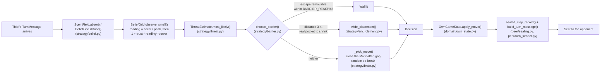

# Architecture

Two diagrams: the wire protocol (handshake, one turn, the end-of-game audit),
and the decision pipeline one police turn actually runs through. Both are
derived from the real call chain in `peer/` and `strategy/`, not aspirational.

## Wire protocol: one sub-game

```mermaid
sequenceDiagram
    participant P as Police (this repo)
    participant T as Thief (separate process)

    Note over P,T: No shared memory, no referee -- everything below is HTTP via FastMCP.

    P->>T: negotiate(signed terms)
    T->>P: negotiate(signed terms)
    Note over P,T: peer/handshake.py -- refuses to play on any mismatch

    loop until a result is reached
        T->>P: receive_turn(TurnMessage: commit, smell_grid, hint, barrier?)
        Note over P: turn_handler.py folds it in: diffuse() then observe_smell()
        P->>P: brain.decide(state, threat, barriers_max) -- strategy/brain.py
        P->>T: receive_turn(TurnMessage: commit, smell_grid, hint, barrier?)
        Note over T: same fold-in, symmetric decision
    end

    Note over P,T: capture / survival / technical loss ends the loop (domain/rules.py)

    P->>T: submit_audit(sealed records + nonces)
    T->>P: submit_audit(sealed records + nonces)
    Note over P,T: peer/summary.py re-hashes every commitment;<br/>a mismatch is a technical loss, not a bug report
```

Every `TurnMessage` carries a SHA-256 `commit` and never the true position
(`peer/protocol.py`). The nonce that would let either side verify it is
withheld until the audit step above -- that lag is the whole commit-reveal
mechanism (`domain/crypto.py`, book ch. 5).

## One police turn: scent to decision



`choose_barrier` is the one branch point worth reading twice: `BARRIER_REACH`
(2) is a hard geometric bound proven in `strategy/barrier.py`'s own docstring
-- no wall further than that can ever touch one of the believed cell's
immediate escapes, so the wide-range path judges by shrinking the thief's
whole reachable pocket instead (`strategy/encirclement.py`), gated by a much
stricter bar than the course reference uses, for the reason documented there.

## Technology choices

Each major dependency was picked for a reason grounded in this project's own
constraints, not by default:

- **FastMCP, symmetric peer-to-peer, no central server.** The specification
  forbids a referee or shared live state (ch. 2.4.2); each peer must be
  independently runnable and independently trustworthy. FastMCP lets each
  process be simultaneously a server for inbound tool calls and a client of
  the opponent's endpoint, which is what makes the "no referee" requirement
  implementable at all — see the five practical problems that symmetry
  creates and how they're addressed, in `README.md`'s "Architecture and trust
  boundaries" section.
- **A hand-engineered Bayesian filter, not a trained RL policy.** The board
  is a Dec-POMDP where the Police agent never observes the Thief's true cell
  (see `README.md`'s "Problem model" section). An explicit belief update over
  legal reachability plus scent likelihood is directly explainable move by
  move, which the project's evidence requirement rewards: `README.md`'s
  "Evidence and parameter study" section documents that no RL model is
  trained or claimed, backed instead by a parameter sensitivity study over
  all nine tunable constants (`docs/RESEARCH.md`,
  `docs/research-data.json`). A learned policy would have no equivalent
  proof of behaviour.
- **SHA-256 commit-reveal, not mutual trust.** Neither peer can see the
  other's true state during play, so every claim has to be either legal-rule
  derivable or cryptographically provable after the fact (`docs/PRD.md`,
  Problem). Sealing `SHA-256(canonical_json(payload) | nonce)` before reveal
  (see the wire-protocol diagram above, and `domain/crypto.py`) means a
  tampered log is detectable at audit time rather than merely alleged.
- **`uv` for dependency management.** Both CI (`.github/workflows/quality.yml`)
  and local development sync from the same committed `uv.lock`, so "it works
  on my machine" cannot happen between the grader's run and the submitted
  environment — the quality gates in CI are literally the same `uv run`
  invocations documented in `README.md`'s Validation section.

## Where this lives in the package

See `README.md`'s own "Layout" section for the directory tree; this document
is about *flow*, not file placement.

For the feature-by-feature implementation map, see
[`FEATURES.md`](FEATURES.md). The protocol and integrity details are in
[`P2P_PROTOCOL.md`](P2P_PROTOCOL.md) and
[`SECURITY_AND_AUDIT.md`](SECURITY_AND_AUDIT.md); the remaining strategy,
front-end, and reporting flows are linked from that index.
