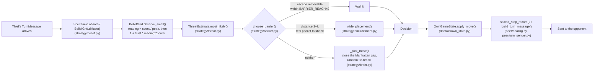

# Architecture

Two diagrams: the wire protocol (handshake, one turn, the end-of-game audit),
and the decision pipeline one police turn actually runs through. Both are
derived from the real call chain in `peer/` and `strategy/`, not aspirational.

## Wire protocol: one sub-game

```mermaid
sequenceDiagram
    participant P as Police (this repo)
    participant T as Thief (separate process)

    Note over P,T: No shared memory, no referee -- everything below is HTTP via FastMCP.

    P->>T: negotiate(signed terms)
    T->>P: negotiate(signed terms)
    Note over P,T: peer/handshake.py -- refuses to play on any mismatch

    loop until a result is reached
        T->>P: receive_turn(TurnMessage: commit, smell_grid, hint, barrier?)
        Note over P: turn_handler.py folds it in: diffuse() then observe_smell()
        P->>P: brain.decide(state, threat, barriers_max) -- strategy/brain.py
        P->>T: receive_turn(TurnMessage: commit, smell_grid, hint, barrier?)
        Note over T: same fold-in, symmetric decision
    end

    Note over P,T: capture / survival / technical loss ends the loop (domain/rules.py)

    P->>T: submit_audit(sealed records + nonces)
    T->>P: submit_audit(sealed records + nonces)
    Note over P,T: peer/summary.py re-hashes every commitment;<br/>a mismatch is a technical loss, not a bug report
```

Every `TurnMessage` carries a SHA-256 `commit` and never the true position
(`peer/protocol.py`). The nonce that would let either side verify it is
withheld until the audit step above -- that lag is the whole commit-reveal
mechanism (`domain/crypto.py`, book ch. 5).

## One police turn: scent to decision



`choose_barrier` is the one branch point worth reading twice: `BARRIER_REACH`
(2) is a hard geometric bound proven in `strategy/barrier.py`'s own docstring
-- no wall further than that can ever touch one of the believed cell's
immediate escapes, so the wide-range path judges by shrinking the thief's
whole reachable pocket instead (`strategy/encirclement.py`), gated by a much
stricter bar than the course reference uses, for the reason documented there.

## Where this lives in the package

See `README.md`'s own "Layout" section for the directory tree; this document
is about *flow*, not file placement.
