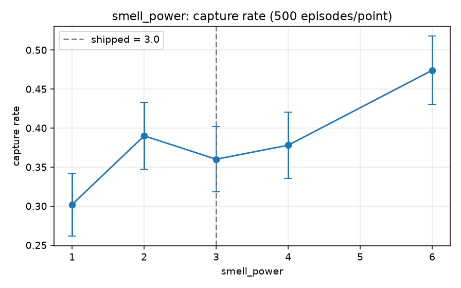
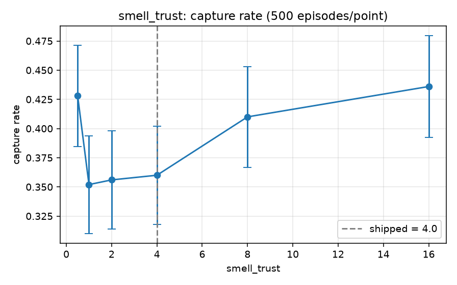
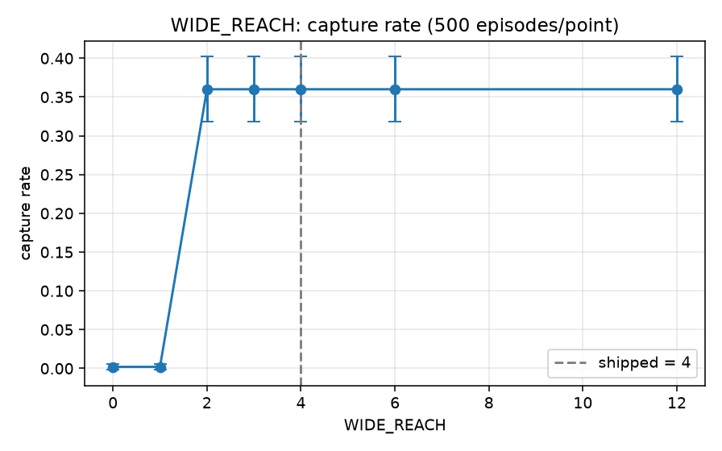
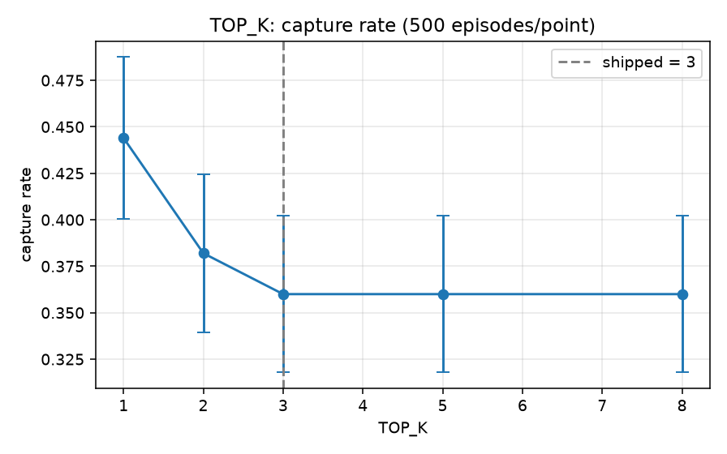

# Parameter sensitivity study

Every tunable constant in the police policy, swept one at a time and scored on
full games. This is the evidence behind the tuning: which shipped defaults the
data supports, which it questions, and which constants turn out not to matter at
all.

Raw numbers: [research-data.json](research-data.json). Figures:
[assets/](../assets). Interactive version:
[notebooks/sensitivity.ipynb](../notebooks/sensitivity.ipynb). Code:
[research/](../research).

```bash
uv sync --extra research
uv run python -m research          # ~6 minutes, regenerates every figure
```

## 1. Method

**Episode.** One full sub-game under the shipped rules: 7×7 board, police at
(0,0), evader at (3,3), 35-move ceiling, 14 barriers, the agreed pheromone
constants. The turn order and the belief-update order are copied from the real
runtime rather than re-invented — `diffuse` then `observe_smell`, exactly as
`peer/turn_handler.py:79` does it — because a sweep run against a different game
measures nothing. All three capture conditions from `domain/semantic_replay.py`
are scored: stepping onto the evader, walling its cell, and confining it.

**Opponent.** A synthetic evader (`research/evader.py`) that greedily maximises
Manhattan distance from the police's *true* cell. Deliberately omniscient: this
is the pessimistic case, so a constant that still helps here is not winning by
luck. It is a trajectory generator, not a thief agent — CLAUDE.md keeps real
thief logic in the other repository, which is why the whole package sits outside
`src/`.

**Design.** One-at-a-time, 500 episodes per point, every point replaying the
*same* seed range so two settings are compared on identical episodes. A full
factorial over nine parameters would be thousands of times the compute for an
interaction effect nothing yet suggests exists.

**Reading the intervals.** Quoted intervals are 95% normal-approximation bounds
on a binomial proportion — ±0.043 at a capture rate near 0.36 with n=500. They
are *conservative*: because the seeds are paired, the error on a difference
between two settings is smaller than the error on either one. Overlapping
intervals here mean "not established", not "no effect".

## 2. Belief-filter constants

The five constants of the Bayesian filter (`strategy/belief_defaults.py`).
Private tuning, not agreed terms, so we are free to choose them.

### smell_power — the shipped value is beaten decisively

| value | capture rate | 95% CI | mean error | hit rate |
|---|---|---|---|---|
| 1.0 | 0.302 | [0.262, 0.342] | 2.60 | 0.307 |
| 2.0 | 0.390 | [0.347, 0.433] | 2.15 | 0.244 |
| **3.0 (shipped)** | **0.360** | [0.318, 0.402] | 1.84 | 0.290 |
| 4.0 | 0.378 | [0.336, 0.420] | 1.53 | 0.316 |
| 6.0 | **0.474** | [0.430, 0.518] | **0.93** | **0.432** |



The clearest result in the study. At 6.0 the filter is better on *every* metric
at once — capture rate up 11 points, localisation error halved, argmax hit rate
up 49% — and the interval does not overlap the shipped value's. Sharpening the
intensity→likelihood curve further than the shipped 3.0 starves faint cells
harder, and against a trail-laying evader that is straightforwardly correct.

### smell_trust — better tracking, *not* more captures

| value | capture rate | 95% CI | mean error | hit rate |
|---|---|---|---|---|
| 0.5 | 0.428 | [0.385, 0.471] | 2.95 | 0.292 |
| 1.0 | 0.352 | [0.310, 0.394] | 2.22 | 0.414 |
| 2.0 | 0.356 | [0.314, 0.398] | 2.00 | 0.344 |
| **4.0 (shipped)** | **0.360** | [0.318, 0.402] | 1.84 | 0.290 |
| 8.0 | 0.410 | [0.367, 0.453] | 1.64 | 0.266 |
| 16.0 | 0.436 | [0.393, 0.479] | **1.52** | 0.258 |



The most interesting result, because the two metrics disagree. Localisation
error falls monotonically as trust rises (2.95 → 1.52), but capture rate is
**U-shaped**, and the shipped 4.0 sits near the bottom of the U. Both ends beat
the middle.

So a better-localising filter does not automatically catch more thieves. The
plausible reading — untested, and flagged as such — is that these are two
different winning mechanisms: a distrustful filter stays diffuse and the police
walls broad areas, while a very trusting one commits hard to one cell and chases
it down. The shipped value is stuck between the two, committed enough to stop
walling broadly but not enough to chase decisively.

### leak — mild, monotone, not established

0.0 → 0.356, 0.15 → 0.420, with error falling 1.99 → 1.48
([figure](../assets/fig-belief-leak.png)). Directionally in favour of a larger
leak, but the intervals overlap. Not established at this sample size.

### stale_decay and stale_support — no measurable effect on outcomes

| stale_decay | 0.5 | 0.7 | **0.85** | 0.95 | 1.0 |
|---|---|---|---|---|---|
| capture rate | 0.394 | 0.368 | **0.360** | 0.360 | 0.360 |
| mean error | 1.83 | 1.85 | **1.84** | 1.84 | 1.83 |

`stale_support` is flatter still: 0.360 at 0.0, 0.05 and 0.1 alike
([figure](../assets/fig-belief-stale-support.png)).

This deserves care, because it does **not** contradict the sweep recorded in
`belief_defaults.py:36`. That one measured a probability *ratio* on a synthetic
probe and found a clean monotonic effect — and it is right. What this study adds
is that the effect does not propagate: a posterior that is measurably better by
that ratio produces the same argmax, the same chase and the same result. Both
findings are true at their own level, and the gap between them is the finding.

Setting `stale_decay = 1.0` disables the mechanism entirely and costs nothing
measurable here. It is retained because absence of evidence at n=500 against one
synthetic evader is not evidence of absence, but it should be re-tested against a
real opponent.

## 3. Strategy constants

### WIDE_REACH — a cliff, then a plateau: barriers *are* the win condition

| value | 0 | 1 | 2 | 3 | **4** | 6 | 12 |
|---|---|---|---|---|---|---|---|
| capture rate | 0.002 | 0.002 | 0.360 | 0.360 | **0.360** | 0.360 | 0.360 |
| mean steps | 35.0 | 35.0 | 27.7 | 27.7 | **27.7** | 27.7 | 27.7 |



The headline structural result. `WIDE_REACH ≤ 1` forbids essentially every wall,
and the capture rate collapses to **0.2%** — one win in 500. Against a competent
evader on an open board the police effectively *cannot* win by chasing alone;
the barrier mechanic is the entire win condition, not a supplement to it.

Above the cliff the curve is perfectly flat: 2 and 12 are indistinguishable,
because the chase keeps the police within two cells of its believed target
anyway, so the range gate almost never binds. `WIDE_REACH` is therefore a safety
floor rather than a tuning knob. The shipped 4 is on the plateau with 2× margin
over the cliff — well chosen, and for a reason the constant's own comment did not
state.

### TOP_K — 1 beats the shipped 3

| value | 1 | 2 | **3** | 5 | 8 |
|---|---|---|---|---|---|
| capture rate | **0.444** | 0.382 | **0.360** | 0.360 | 0.360 |
| 95% CI | [0.400, 0.488] | [0.339, 0.425] | [0.318, 0.402] | — | — |



Weighing the barrier choice against the single most likely cell outperforms
spreading it over the top three by about 8 points. The intervals *just* overlap —
[0.400, 0.488] against [0.318, 0.402], a 0.002 sliver — so on the conservative
unpaired reading this is right at the edge of significance rather than past it.
The seeds are paired, which makes the true difference more secure than that
sliver suggests, but the honest summary is "strongly suggestive, one confirmation
run short of established".

Above 3 the curve is perfectly flat — the fourth and later cells carry too little
mass to change any decision, so the shipped 3 is already paying full price for a
spread that does not help.

### ESCAPE_WEIGHT, MIN_GAIN_FRACTION, MIN_GAIN_FLOOR — no measurable effect

All three are flat across their whole ranges (0.358–0.366, 0.360, 0.360
respectively). `MIN_GAIN_FRACTION` **independently confirms** the 360-start
benchmark already recorded at `encirclement.py:44` — a different benchmark,
scored on game outcomes rather than gain values, reaching the same conclusion.

One nuance the older note did not predict: `MIN_GAIN_FLOOR` is flat too, from 1
to 8. The comment argues the floor is the gate that does the work, and relative
to the fraction it is — but varying it changes no outcome here, which suggests
the marginal walls it admits or refuses are ones `best_placement` was never going
to rank first anyway.

## 4. Summary

| Constant | Shipped | Verdict |
|---|---|---|
| `smell_power` | 3.0 | **Questioned.** 6.0 is better on every metric, intervals disjoint. |
| `TOP_K` | 3 | **Questioned.** 1 is better by ~8 points; intervals overlap by 0.002. |
| `smell_trust` | 4.0 | **Questioned.** Sits in the U's trough; both 0.5 and 16.0 beat it. |
| `WIDE_REACH` | 4 | **Supported.** Safe margin above a hard cliff at 2. |
| `leak` | 0.03 | Directionally low, not established. |
| `stale_decay` | 0.85 | No measurable effect on outcomes. |
| `stale_support` | 0.1 | No measurable effect on outcomes. |
| `ESCAPE_WEIGHT` | 0.5 | No measurable effect. |
| `MIN_GAIN_FRACTION` | 0.22 | No measurable effect (confirms the existing note). |
| `MIN_GAIN_FLOOR` | 2 | No measurable effect. |

**No default was changed on the strength of this study**, and that is a
deliberate decision rather than an oversight — see below.

## 5. What this study does not claim

1. **The opponent is not a thief.** Every number here is measured against one
   synthetic, omniscient, greedily-fleeing evader. A real thief has partial
   observability, lays scent strategically, bluffs, and does not maximise
   distance every turn. Retuning `smell_power` or `TOP_K` on this evidence could
   easily be overfitting to a fixture. The three "questioned" rows above are
   **hypotheses for a follow-up against a real opponent**, not config changes to
   make before submission.
2. **One board, one geometry.** 7×7, fixed starts, 35 steps, 14 barriers. Nothing
   here says how any constant behaves on a larger board or a longer game.
3. **One-at-a-time.** Interactions are not measured. `smell_power = 6` with
   `TOP_K = 1` might be better or worse than either alone.
4. **"No measurable effect" is bounded by the sample.** At n=500 an effect
   smaller than roughly ±0.04 in capture rate is invisible here. Several
   constants may matter in ways this study cannot see.
5. **No claim about scoring.** Capture rate is not league score; the agreed
   weighting (capture 20/5, survival 5/10) is not modelled.
